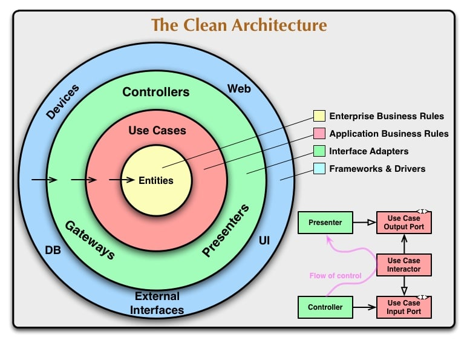

## DDD 结构设计

参考文章: [前端领域的 “干净架构”](https://juejin.cn/post/7054888223830441991#heading-37)

### 设计




### 目录结构

```
src/
|_domain/    领域层: 实体/值对象
  |_user.ts
  |_product.ts
  |_order.ts
  |_cart.ts
  |_shared-kernel.d.ts  共享内核
|_application/   应用层: 用例/外部服务端口
  |_addToCart.ts
  |_authenticate.ts
  |_orderProducts.ts
  |_ports.ts
|_services/      适配层: 外部服务
  |_authAdapter.ts
  |_notificationAdapter.ts
  |_paymentAdapter.ts
  |_storageAdapter.ts
  |_api.ts
  |_store.tsx
|_lib/  utils
|_ui/   UI 展示组件
```
