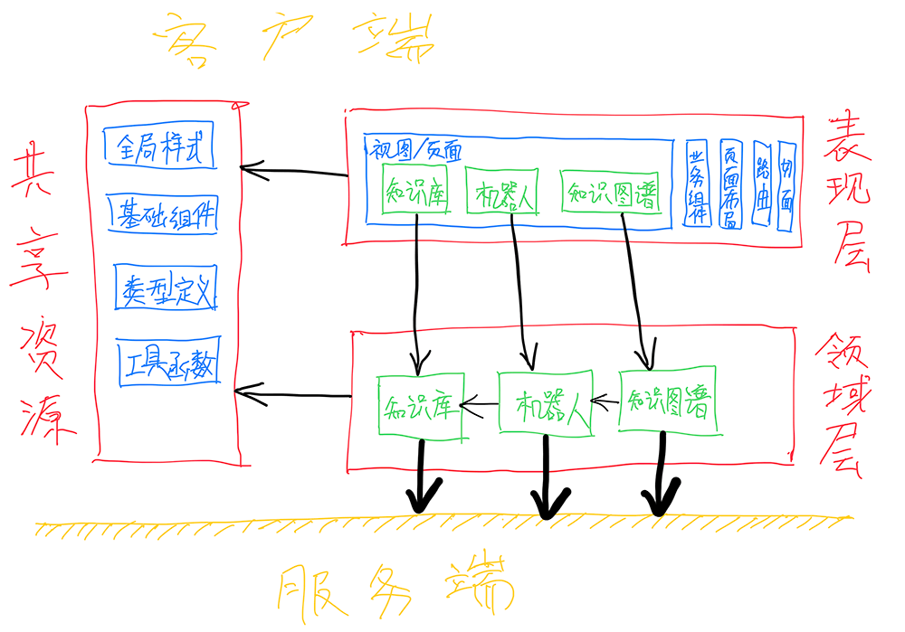
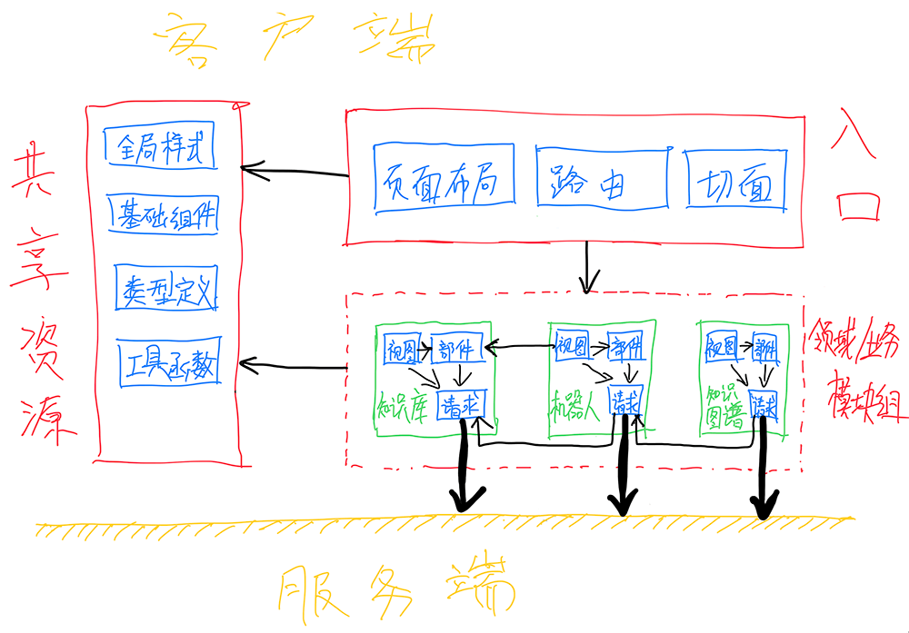

## PDD

presentation-domain-data

分模块 - 功能优先

参考文档:

- [聊聊中后台前端应用：目录结构划分模式](https://ourai.ws/posts/patterns-of-directory-structure-in-frontend-projects/)

### 设计





### 目录结构

```
project/src
   ├── [domain-specific-module]
   │   ├── views
   │   │   ├── [detail-view]
   │   │   │   ├── [DetailViewComponent].tsx
   │   │   │   ├── ...
   │   │   │   └── style.scss
   │   │   ├── [form-view]
   │   │   │   ├── [FormViewComponent].tsx
   │   │   │   ├── ...
   │   │   │   └── style.scss
   │   │   └── [list-view]
   │   │       ├── [ListViewComponent].tsx
   │   │       ├── ...
   │   │       └── style.scss
   │   ├── widgets
   │   │   └── [domain-specific-widget]
   │   │       └── ...
   │   ├── helper.ts
   │   ├── index.ts
   │   ├── model.ts
   │   ├── repository.ts
   │   └── ...
   ├── entry
   │   ├── aspects
   │   │   ├── http.ts
   │   │   ├── router.ts
   │   │   ├── ...
   │   │   └── index.ts
   │   ├── layouts
   │   │   └── ...
   │   └── router
   │       └── ...
   ├── shared
   │   └── ...
   ├── App.tsx
   └── main.ts
```
